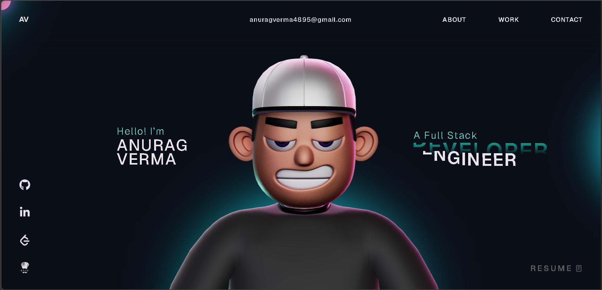

<div align="center">
  

  <h1 align="center">My 3D Interactive Portfolio 🚀</h1>

  <p align="center">
    A highly interactive and immersive personal portfolio website built with modern web technologies, featuring a fully controllable 3D character and smooth scroll animations.
    <br />
    <br />
    <a href="https://github.com/anuragverma4895/Portfolio"><strong>Explore the docs »</strong></a>
    <br />
    <br />
    <a href="https://anuragverma-dev.vercel.app/">View Live Demo</a>
    ·
    <a href="https://github.com/anuragverma4895/Portfolio/issues">Report Bug</a>
    ·
    <a href="https://github.com/anuragverma4895/Portfolio/issues">Request Feature</a>
  </p>
</div>

<br/>

## ✨ Features

- **Immersive 3D Experience:** Navigate the portfolio guided by an animated 3D character, fully integrated via `Three.js` and `React Three Fiber`.
- **Smooth Animations:** Buttery smooth scrolling and staggered text animations powered by `GSAP` (GreenSock Animation Platform).
- **Interactive UI/UX:** Custom cursors, hover interactions, and loading states for a premium feel.
- **Fast & Optimized:** Built on top of `Vite` + `React` for extremely fast load times and optimized asset delivery.
- **Responsive Design:** Looks great and performs well across a myriad of screen sizes and devices.

## 🛠️ Built With

This project relies on a powerful modern tech stack to deliver high performance and deep interactivity.

* [![React][React.js]][React-url]
* [![TypeScript][TypeScript]][TypeScript-url]
* [![Vite][Vite.js]][Vite-url]
* [![Three.js][Three.js]][Three-url]
* [![GSAP][GSAP.com]][GSAP-url]

## 🚀 Getting Started

Follow these instructions to get a copy of the project up and running on your local machine for development and testing purposes.

### Prerequisites

Make sure you have Node.js and npm installed on your machine.

* npm
  ```sh
  npm install npm@latest -g
  ```

### Installation

1. Clone the repository
   ```sh
   git clone https://github.com/anuragverma4895/Portfolio.git
   ```
2. Navigate to the project directory
   ```sh
   cd Portfolio
   ```
3. Install NPM packages
   ```sh
   npm install
   ```
4. Run the local development server
   ```sh
   npm run dev
   ```
   The site will be available at `http://localhost:5173`.

> **Note regarding GSAP:**
> The project now uses the fully free, standard `gsap` package. No trial plugins are used, allowing the project to be easily deployed to standard hosting platforms like Vercel, Netlify, or GitHub Pages.

## 📄 License

Distributed under the MIT License. See `LICENSE` for more information.

## 👨‍💻 Contact

Anurag Verma - [anuragverma4895@gmail.com](mailto:anuragverma4895@gmail.com)

Project Link: [https://github.com/anuragverma4895/Portfolio](https://github.com/anuragverma4895/Portfolio)

<!-- MARKDOWN LINKS & IMAGES -->
[React.js]: https://img.shields.io/badge/React-20232A?style=for-the-badge&logo=react&logoColor=61DAFB
[React-url]: https://reactjs.org/
[TypeScript]: https://img.shields.io/badge/TypeScript-007ACC?style=for-the-badge&logo=typescript&logoColor=white
[TypeScript-url]: https://www.typescriptlang.org/
[Vite.js]: https://img.shields.io/badge/Vite-646CFF?style=for-the-badge&logo=vite&logoColor=white
[Vite-url]: https://vitejs.dev/
[Three.js]: https://img.shields.io/badge/Three.js-000000?style=for-the-badge&logo=threedotjs&logoColor=white
[Three-url]: https://threejs.org/
[GSAP.com]: https://img.shields.io/badge/GSAP-88CE02?style=for-the-badge&logo=greensock&logoColor=white
[GSAP-url]: https://gsap.com/
